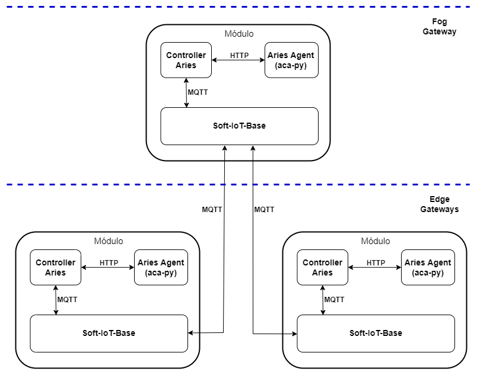

# soft-iot-dlt-client-hyperledger-aries

O `soft-iot-dlt-client-hyperledger-aries` é o _bundle_ genérico que pode atuar tanto na camada _Edge_ quanto na _Fog_. Ele responsável por realizar requisições MQTT para o controlador de um _Aries Agent_.

## Modelo da arquitetura

  

## Comunicação

### `Definição de Credencial`

A partir do momento em que o _bundle_ iniciar, é enviada uma publicação MQTT para o Agent Aries Controller com objetivo criar a definição de credencial e armazená-la na _blockchain_.

| Propriedades da Definição de Credencial | Valor padrão  |
| --------------------------------------- | ------------- |
| name                                    | soft-iot-base |
| version                                 | 1.0           |

| Atributos | Descrição                  |
| --------- | -------------------------- |
| id        | Identificador do _gateway_ |

---

### `Estabelecimento de Conexão entre Agentes`

Assim que um _fog gateway_ se conectar a um _edge gateway_, o _fog gateway_ envia uma publicação MQTT para o _Agent Aries Controller_ a fim de receber uma URL de conexão de seu agente. A partir disto, o _fog gateway_ envia a URL para o _edge gateway_ para o mesmo aceitar a URL conexão no seu próprio agente.

###### A URL de conexão é gerada pelo agente emissor em _base64_ e decodificada no agente receptor.

---

### `Emissão de Credencial`

O _fog gateway_ envia uma publicação MQTT para o Agent Aries Controller com objetivo do mesmo emitir uma credencial para um agente de um _edge gateway_.

---
